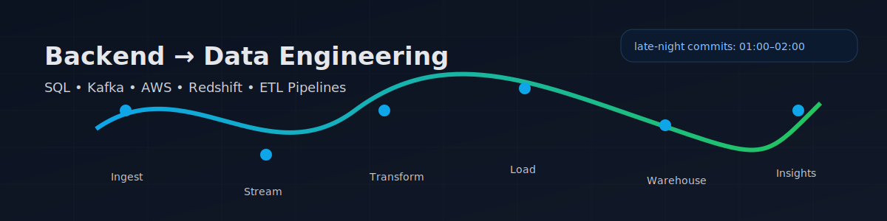

# 👋 Hi, I'm Priyanshu Jha

**Backend-to-DataEng Intern @ Ekacare** | Building ETL pipelines with SQL, Kafka & AWS

---

## 🛠️ Tech Stack & Skills

### **Databases & Data Warehouses**

### **Data Processing & Streaming**

### **Cloud & Infrastructure**

### **Languages & Tools**

### **Visualization & BI**

---

## 📊 GitHub Stats & Activity

  

---

## 🔥 Featured Projects

### **LinkedIn Scraper (Personal Job Pipeline)**
**Playwright + Express | CSV exports**
- Automated LinkedIn job scraping runs + simple UI to trigger runs/download exports
- Multi-keyword search + time filters (past 24h / past week)

### **AI CloudOps**
**Python | FastAPI dashboard + Tkinter GUI**
- Modular CloudOps tooling with safe `.env` config (no secrets committed)
- Web dashboard + desktop GUI structure for extending features

### **Computer Vision Drawing**
**OpenCV + MediaPipe**
- Hand-tracking based drawing/erase workflow using webcam input

### **Computer Vision Game**
**OpenCV + Hand Tracking**
- Webcam hand-gesture controls for interactive gameplay experiments

### **AWS S3 Browser**
**Python + Tkinter + boto3**
- Simple desktop app to browse/manage S3 with a GUI

---

## 💻 Coding Activity

---

## 🏆 Achievements & Certifications

- 🥇 **SQL Mastery**: Top 5% on HackerRank SQL Challenges
- 🏅 **Data Engineering**: Building production-grade ETL pipelines at Ekacare
- 📚 **Continuous Learning**: Late-night coding sessions (1-2 AM) mastering new technologies

---

## 📈 GitHub Contribution Graph

---

## 🤝 Let's Connect!

---

**💼 Open to PPO Negotiations** | **📍 Bengaluru, India** | **🚀 Seeking Data Engineering Roles 2026**

*Transitioning from Backend Development to Data Engineering | Building scalable ETL pipelines | SQL Wizard | Kafka Enthusiast*

**⚡ Fun Fact**: I code best between 1-2 AM when the world is quiet and data flows smoothly! 🌙

